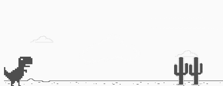

# 🦖 Dino Game – Desafio DIO

Recriação do clássico jogo do dinossauro do navegador (Chrome Dino), como parte de um desafio proposto pela Digital Innovation One (DIO).

## 🚀 Tecnologias Utilizadas

- HTML5
- CSS3
- JavaScript

## 🎮 Funcionalidades

- Dino com animação de pulo
- Obstáculos (cactos) gerados dinamicamente
- Sistema simples de colisão

## 📚 Objetivo do Projeto

Praticar lógica de programação, manipulação do DOM com JavaScript puro e reforçar conceitos básicos de front-end por meio de um projeto lúdico e interativo.

## 📸 Imagem

## 🧠 Aprendizados

- Eventos de teclado
- Manipulação do estilo via JavaScript
- Uso de `setInterval`, `clearInterval` e `setTimeout`
- Lógica de colisão entre elementos no DOM

## 🛠️ Como Executar

1. Clone este repositório
2. Abra o arquivo `index.html` em um navegador moderno
3. Espaço pula!

---

Desenvolvido por Leonardo Ruoso Vendramini • [leorv](https://github.com/leorv)
